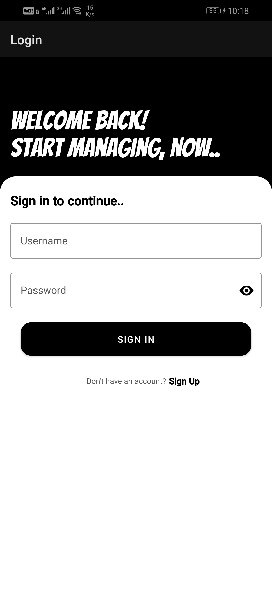
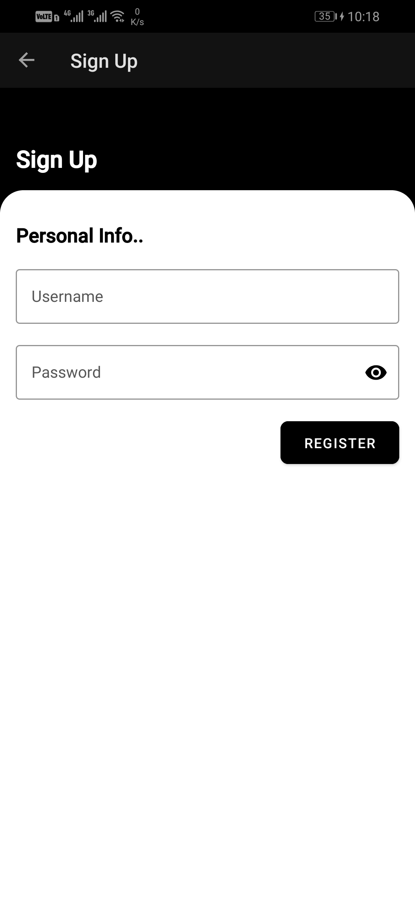
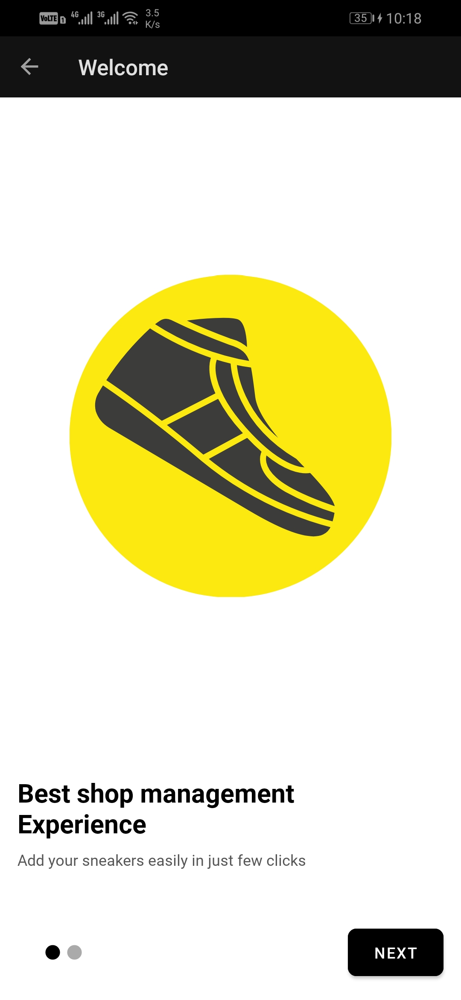
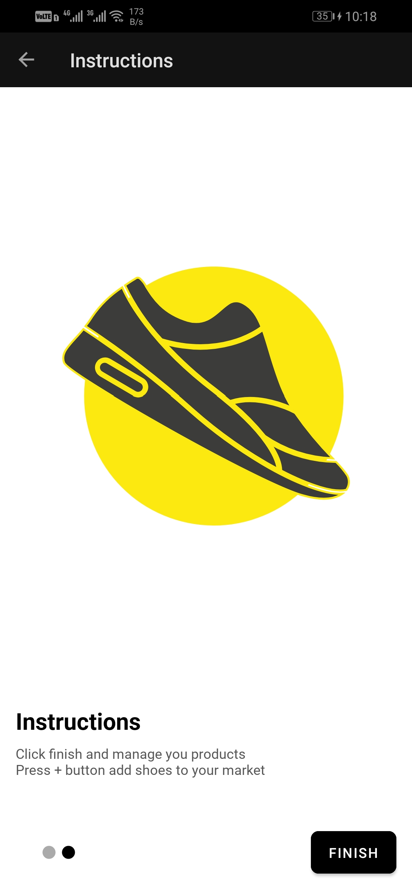
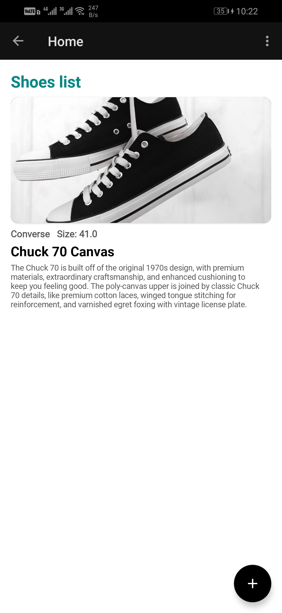
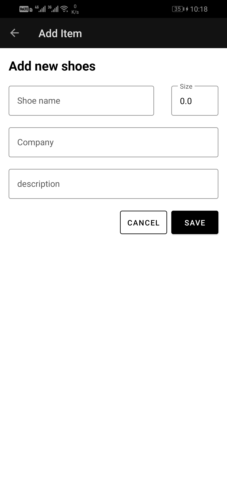

# The Shoe Store
### This project will consist of five screens. 

* Login screen: Email and password fields and labels plus create and login buttons
* Welcome onboarding screen
* Instructions onboarding screen
* Shoe Listing screen
* Shoe Detail screen for adding a new shoe

## This app demonstrates the following views and techniques:
* SharedViewModel
* Navigation Component
* Layouts

## Also uses and builds on the following techniques:
* Data Binding in XML files
* ViewModel Factory
* Using Backing Properties to protect MutableLiveData
* Observable state LiveData variables to trigger navigation

## Screenshots
 | 

 | 

 | 
